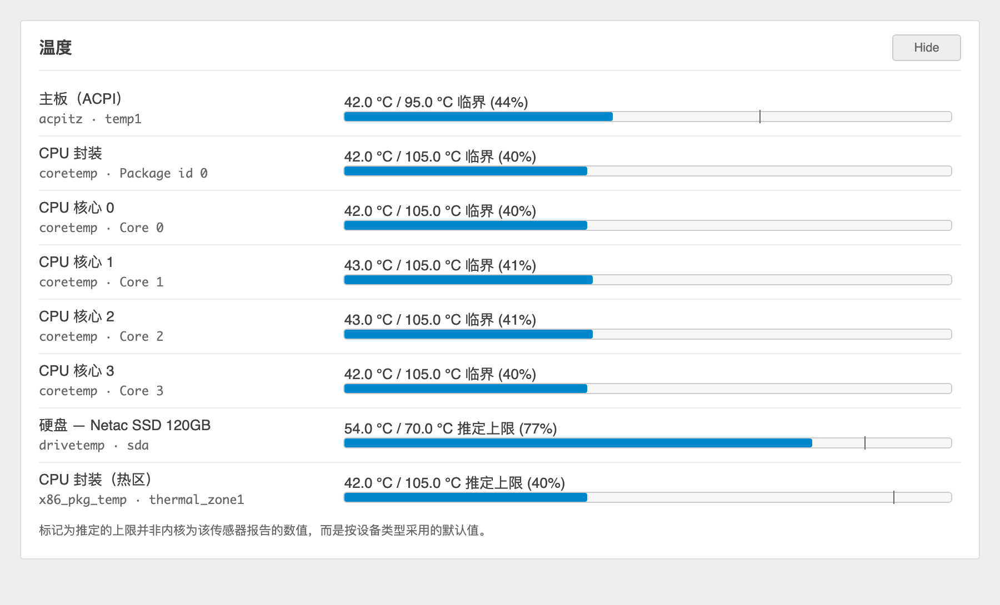

# luci-app-thermal

Temperature sensors for the OpenWrt LuCI status page.

Adds a **Temperature** block to *Status → Overview*, alongside Memory and
Storage, built from the same `.cbi-progressbar` those blocks use — so it reads
as part of the page rather than a bolted-on panel.

**OpenWrt 25.x or later.**



## Why another temperature app

Reading `/sys/class/hwmon` and `/sys/class/thermal` naively goes wrong in three
specific ways. This package handles all three:

**Trip points survive the hwmon/thermal merge.** With `CONFIG_THERMAL_HWMON`,
every thermal zone gets an hwmon twin that carries the reading but *not* the
zone's trip points. Preferring hwmon therefore discards the only real limits
the kernel offered. On a Celeron J4125, `acpitz` exposes no thresholds via
hwmon while `thermal_zone0` declares `critical 95 / active 65`; this package
keeps the reading and folds the zone's trip points back in.

**Invalid trip points are discarded, not clamped.** `x86_pkg_temp` reports
`-274000` m°C — the kernel's `THERMAL_TEMP_INVALID` sentinel — on boards where
the BIOS never programmed the threshold registers. Anything at or below
absolute zero is dropped rather than treated as a limit.

**Assumed limits say so.** `drivetemp` exports no `_crit` or `_max` at all.
Showing a disk against a 105 °C CPU limit makes it look fine right up until it
isn't, so limits fall back to a per-device-class default and the UI labels them
as assumed.

## Install

Grab the `.apk` files from [Releases](../../releases), copy them to the router,
then:

```sh
apk add --allow-untrusted ./luci-app-thermal-*.apk
apk add --allow-untrusted ./luci-i18n-thermal-zh-cn-*.apk   # optional
service rpcd restart
```

`service rpcd restart` is required — the backend is an rpcd ucode plugin and is
not picked up until rpcd reloads.

Disk temperature additionally needs `kmod-hwmon-drivetemp` (SATA/SAS). NVMe
works out of the box, since `kmod-nvme` forces `CONFIG_NVME_HWMON=y`.

## Repository layout

```
luci-app-thermal/    the package
tests/               CI checks
.github/workflows/   SDK build + release
```

Full package documentation, ubus API and design notes:
**[luci-app-thermal/README.md](luci-app-thermal/README.md)**

## Building

Uses [openwrt/gh-action-sdk](https://github.com/openwrt/gh-action-sdk). Run the
**build-packages** workflow from the Actions tab; artifacts appear on the run.
**release-packages** additionally publishes a tagged release.

The ImageBuilder cannot build this — it only assembles pre-built packages and
has no compiler. The SDK is required, not least because `po2lmo` must turn
`po/*.po` into the `.lmo` files LuCI loads at runtime.

## Preview without a router

```sh
cd luci-app-thermal && python3 -m http.server 8799
```

Open `http://localhost:8799/preview/preview.html`. It executes the real
`29_thermal.js` against a fixture captured from live hardware, with LuCI's
`baseclass`/`rpc` shimmed — so what renders is the shipping code path, not a
mock-up. The 中文 button swaps in the actual `po/zh_Hans/thermal.po`.

## License

MIT
